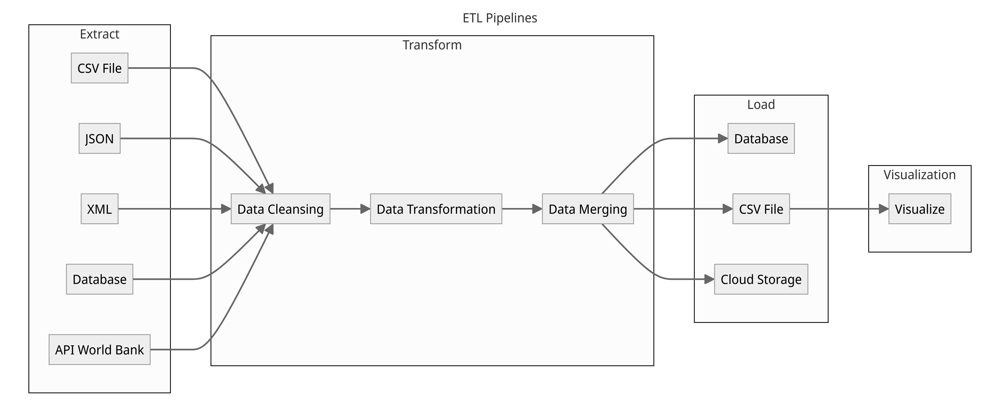

# Mini Project DE Hikmal Naki

## About Project
ETL adalah singkatan dari Extract, Transform, Load. Tujuan utama dari Mini Project ini adalah untuk membersihkan kumpulan data dan menggabungkannya menjadi satu tabel yang nantinya bisa digunakan untuk menjalankan model prediksi biaya total proyek Bank Dunia.

## Tech Stacks
**Tools:**
1. Python
2. Vscode
3. Jupyter Notebook
4. Github
5. Firebase
6. Prefect

**Libraries:**
1. Python Libraries
    -   os
    -   pandas
    -   beautifulsoup4
    -   requests
    -   sqlite3
    -   numpy
    -   scikit-learn
    -   country-converter
    -   firebase-admin
    -   python-dotenv
    -   nbformat
    -   nbconvert
    -   openai
    -   matplotlib
    -   seaborn
    -   plotly-express


## Architecture Diagram


## Setup 

#### Prasyarat
Pastikan telah menginstal software berikut:
1. Python 3.8+
2. Visual Studio Code (VSCode)
3. Jupyter Notebook
4. Git
5. Virtual Environment (opsional tetapi direkomendasikan)

#### Langkah-langkah

1. **Clone Repository dari Github**
   - Buka terminal atau command prompt
   - Clone repository dengan perintah:
     ```
     git clone https://github.com/HikNaki/Mini_Project-DE-Hikmal-Naki.git
     ```

2. **Membuat dan Mengaktifkan Virtual Environment**
   - Buat virtual environment:
     ```
     python -m venv env
     ```
   - Aktifkan virtual environment:
     - Untuk Windows:
       ```
       .\env\Scripts\activate
       ```
     - Untuk macOS/Linux:
       ```
       source env/bin/activate
       ```

3. **Menginstal Dependencies**
   - Pastikan berada di dalam direktori proyek
   - Instal semua library yang dibutuhkan menggunakan pip:
     ```
     pip install <nama library>
     ```

4. **Mengatur Environment Variables**
   - Buat file .env di direktori root proyek untuk menyimpan variabel lingkungan Anda
   - Buka file .env dan tambahkan konfigurasi berikut:
     ```
     FIREBASE_STORAGE = "Firebase Storage ID"
     ACCOUNT_KEY = "Firebase Account KEY"
     NAGA_AI_KEY = "API KEY"
     ```

5. **Menjalankan Prefect**
   - Instal Prefect:
     ```
     pip install prefect
     ```
   - Setup Prefect Cloud:
     ```bash
     prefect cloud login --key <YOUR_PREFECT_CLOUD_API_KEY> --workspace <YOUR_WORKSPACE_NAME>
     ```

6. **Menjalankan ETL Pipeline**
   - Jalankan file data pipeline workflow:
     ```
     python code/data_pipeline_workflow
     ```
   - Buka workspace dari prefect cloud untuk melihat ETL yang telah berhasil dijalankan